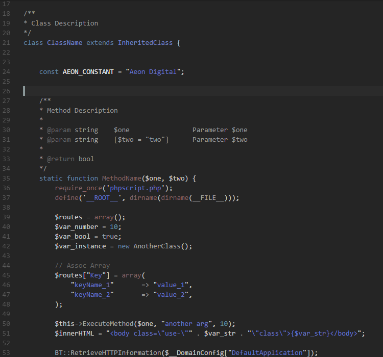
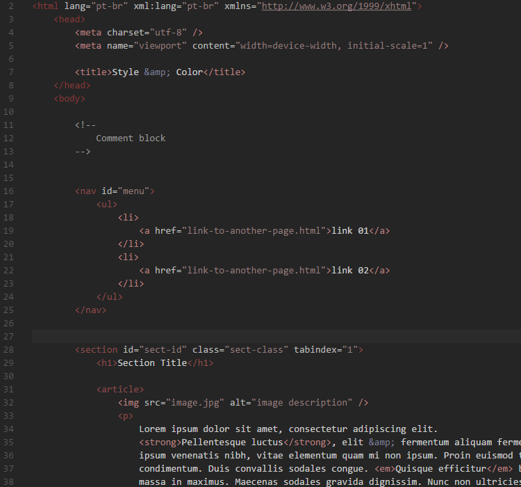
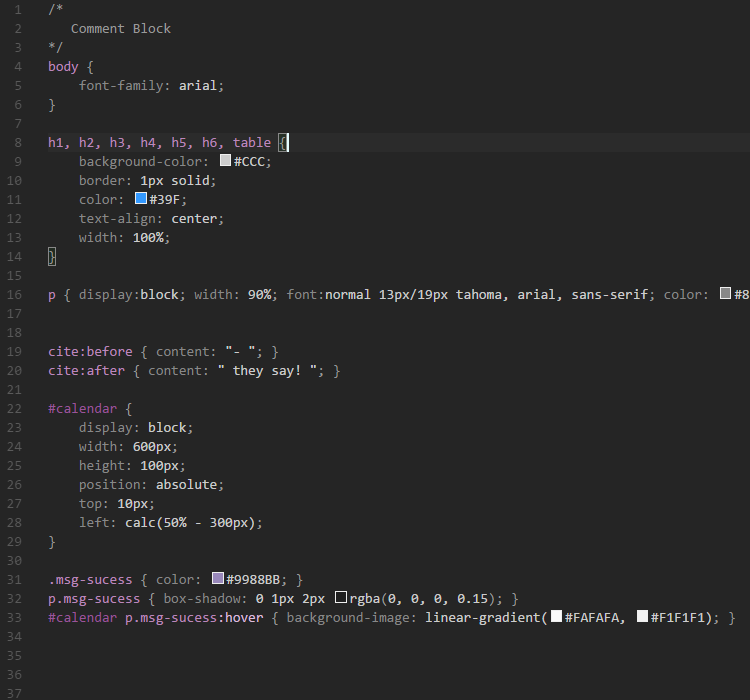
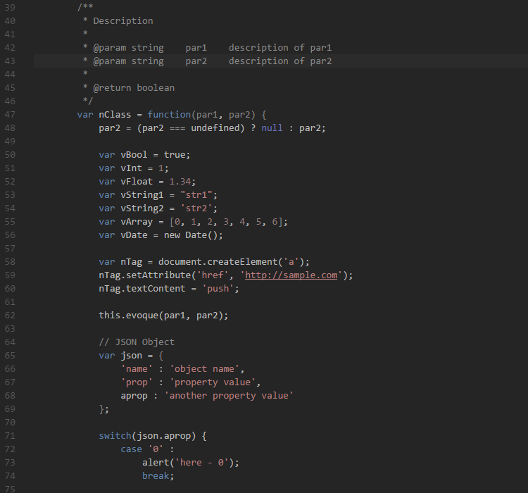
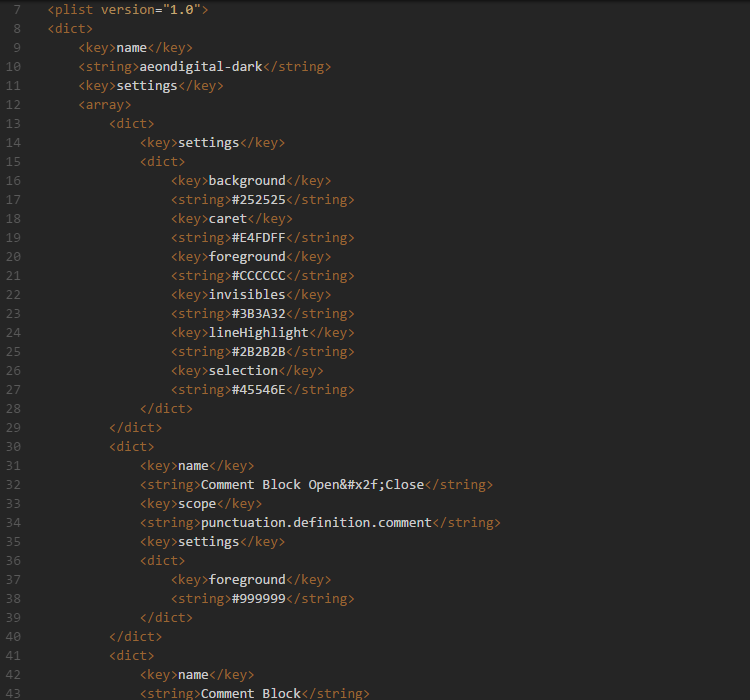
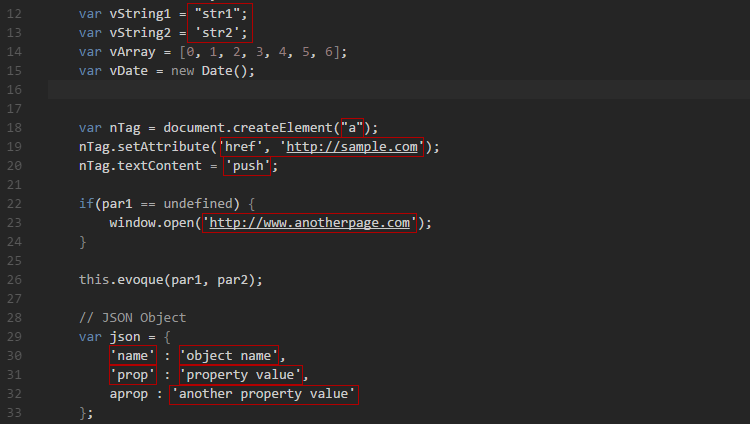

# Aeon Digital - Dark Theme
Desenvolvido por [Aeon Digital](http://aeondigital.com.br)

Esquema de cores desenvolvido para editores compatíveis com o padrão [TextMate themes](https://macromates.com) utilizando o [TmTheme Editor](http://tmtheme-editor.herokuapp.com)
Foi otimizado para o Visual Studio Code versão 1.3.1.

## Linguagens suportadas
Para esta versão, a seguinte coleção de linguagens foram escolhidas para serem contempladas.

- PHP
- X/HTML
- CSS
- Javascript
- XML

## Screenshots

** PHP **

-

-
** HTML **

-

-
** CSS **

-

-
** Javascript **

-

-
** XML **

-

## Ajustes para VS Code
Até a versão atual (1.3.1) por algum motivo desconhecido, o esquema de cores definido para X/HTML não é corretamente carregado pelo VS Code e alguns estilos só serão observados corretamente efetuando a seguinte alteração em seu arquivo de configurações pessoais:

    Menu:
    File -> Preferences -> User Settings

    // Adicione as seguintes chaves em "files.associations":
    "files.associations": {
        "*.html" : "php",
        "*.htm" : "php"
    },

## Bugs conhecidos
Mais estranho que a necessidade do ajuste indicado acima é que o estilo "JS Value String" que define a cor de strings cercadas por aspas simples e duplas em contexto de código Javascript funcionará APENAS em arquivos .html, .htm, .php e .phtml.
Segue abaixo um screenshot do mesmo trecho de código mostrado acima para Javascript mas aberto em um arquivo ".js". Por algum acaso, justo para arquivos ".js" o estilo dos textos não pega.

________________________________________________________________________________